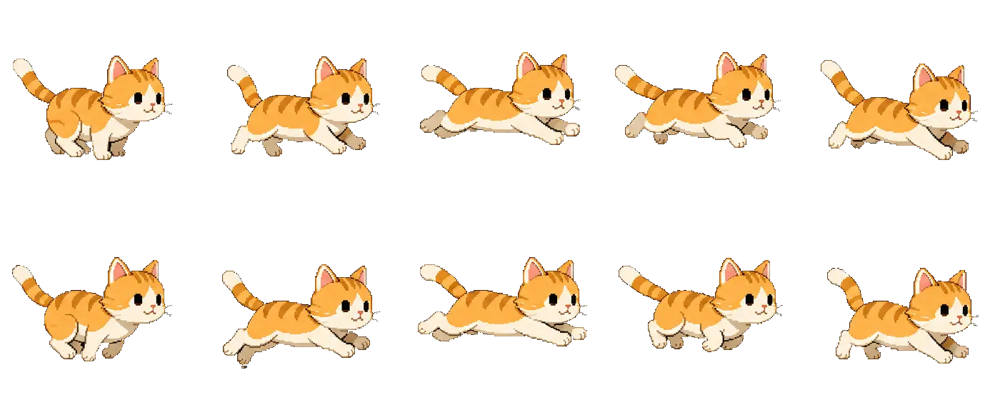

# mason-sprite

[](https://www.npmjs.com/package/mason-sprite)
[](./LICENSE)

**v0.1.2** — Lightweight sprite sheet animation for **React**, **Vue**, and **Svelte** — one package, subpath imports.

Drop in a PNG or WebP sprite sheet, set `rows`, `cols`, and `fps` — and you're done. No Lottie, no timeline editor. Just a simple **CSS** or **Canvas** sprite player.

**Demo & docs:** [mason-sprite.com](https://mason-sprite.com)

## Preview

One sprite sheet, a few props — animation on screen.

<table>
  <tr>
    <td align="center" width="50%">
      <strong>Sprite sheet</strong><br />
      <code>img-cat-run.webp</code> · 2 rows × 5 cols
      <br /><br />
      
    </td>
    <td align="center" width="50%">
      <strong>Rendered with mason-sprite</strong><br />
      <code>rows={2}</code> · <code>cols={5}</code> · <code>fps={10}</code>
      <br /><br />
      
    </td>
  </tr>
</table>

```
img-cat-run.webp  →  rows × cols  →  looping animation
 (WebP sheet)         (2 × 5)          (CSS or Canvas)
```

Try it live on **[mason-sprite.com](https://mason-sprite.com)**.

## Install

```bash
npm install mason-sprite
```

Peer dependencies (install only what you use):

| Framework | Peers |
|-----------|-------|
| React | `react`, `react-dom` |
| Vue 3 | `vue` |
| Svelte | `svelte` |

## Usage

### Core engine (vanilla JS)

```ts
import { SpriteAnimator } from 'mason-sprite';

const animator = new SpriteAnimator({
  src: '/sprites/cat-run.webp',
  rows: 2,
  cols: 5,
  fps: 10,
  loop: true,
  width: '8rem',
  height: '8rem',
});

animator.attach(document.getElementById('sprite')!);
animator.play();
```

### React

```tsx
import { Sprite } from 'mason-sprite/react';

<Sprite
  src="/sprites/cat-run.webp"
  rows={2}
  cols={5}
  fps={10}
  loop
  width="8rem"
  height="8rem"
/>
```

### Vue 3

```vue
<script setup>
import { Sprite } from 'mason-sprite/vue';
</script>

<template>
  <Sprite
    src="/sprites/cat-run.webp"
    :rows="2"
    :cols="5"
    :fps="10"
    :loop="true"
    width="8rem"
    height="8rem"
  />
</template>
```

### Svelte

```svelte
<script>
  import { Sprite } from 'mason-sprite/svelte';
</script>

<Sprite
  src="/sprites/cat-run.webp"
  rows={2}
  cols={5}
  fps={10}
  loop
  width="8rem"
  height="8rem"
/>
```

## Exports

| Import path | Contents |
|-------------|----------|
| `mason-sprite` | `SpriteAnimator`, types, utilities |
| `mason-sprite/react` | `Sprite`, `useSprite` |
| `mason-sprite/vue` | `Sprite` component |
| `mason-sprite/svelte` | `Sprite` component |

## Features

- PNG / WebP sprite sheet support
- CSS or Canvas rendering
- Responsive sizing — `width` / `height` accept CSS lengths (`rem`, `em`, `%`, `vw`, etc.)
- Canvas mode uses `ResizeObserver` and `devicePixelRatio` for sharp rendering
- `play`, `pause`, `stop`, `goToFrame` controls
- Works with any uniform grid sprite sheet (`rows × cols`)

## Sprite Sheet Requirements

- Uniform grid — every frame is the same size
- PNG or WebP format
- `rows × cols` = total frame count

## Development

```bash
pnpm install
pnpm build
pnpm typecheck
```

## Publish

```bash
npm publish
```

## License

MIT
